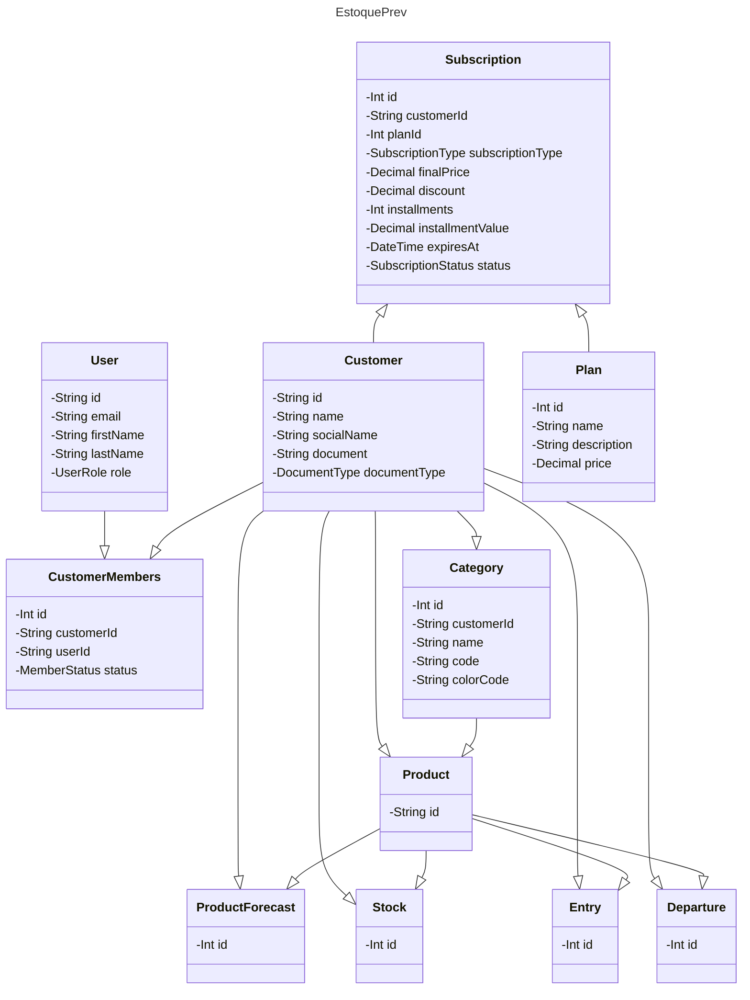

# EstoquePrev

Sistema de Controle de Estoque Inteligente

---

```mermaid
---
title: EstoquePrev
---
classDiagram
    User --|> CustomerMembers
    Customer --|> CustomerMembers

    Subscription <|-- Plan
    Subscription <|-- Customer

    Customer --|> Category
    Customer --|> Product
    Customer --|> ProductForecast
    Customer --|> Stock
    Customer --|> Entry
    Customer --|> Departure

    Category --|> Product

    Product --|> ProductForecast
    Product --|> Stock
    Product --|> Entry
    Product --|> Departure

    User : -String id
    User : -String email
    User : -String firstName
    User : -String lastName
    User : -UserRole role

    CustomerMembers : -Int id
    CustomerMembers : -String customerId
    CustomerMembers : -String userId
    CustomerMembers : -MemberStatus status

    Customer : -String id
    Customer : -String name
    Customer : -String socialName
    Customer : -String document
    Customer : -DocumentType documentType

    Plan : -Int id
    Plan : -String name
    Plan : -String description
    Plan : -Decimal price

    Subscription : -Int id
    Subscription : -String customerId
    Subscription : -Int planId
    Subscription : -SubscriptionType subscriptionType
    Subscription : -Decimal finalPrice
    Subscription : -Decimal discount
    Subscription : -Int installments
    Subscription : -Decimal installmentValue
    Subscription : -DateTime expiresAt
    Subscription : -SubscriptionStatus status

    Category : -Int id
    Category : -String customerId
    Category : -String name
    Category : -String code
    Category : -String colorCode

    Product : -String id

    ProductForecast : -Int id

    Stock : -Int id

    Entry : -Int id
    
    Departure : -Int id
```